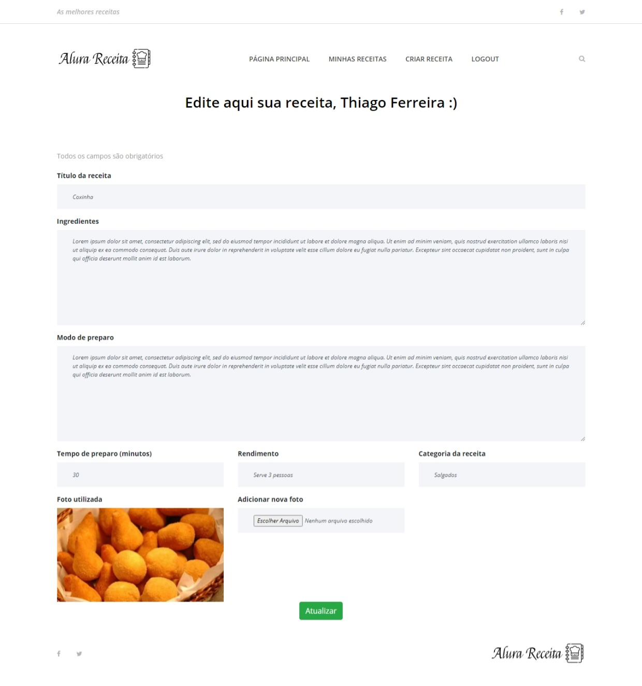

# Alura Receitas

O Alura receitas é uma aplicação que foi desenvolvida ao longo de cursos da formação Django da Alura.
Trata-se de um site de receitas onde é possível se cadastrar e criar suas próprias receitas e visualizar receitas publicadas por outros usuários/admins, além da parte de administração do Django que é muito poderosa, onde podemos gerenciar todos os dados na nossa aplicação.

<strong>Curso:</strong> https://cursos.alura.com.br/formacao-django

### Tabela de Conteúdos

##### Páginas do site
* [Página Principal](#página-principal)
* [Cadastro de usuário](#cadastro-de-usuário)
* [Login de usuário](#login-de-usuário)
* [Dashboard do usuário](#dashboard-do-usuário)
* [Criação de novas Receitas](#criação-de-novas-receitas)
* [Edição de Receitas](#edição-de-receitas)

##### Veja como executar esse projeto na sua máquina
* [Como executar o projeto?](#como-executar-o-projeto)

#### Página Principal

Mostrando todas as receitas que estão marcadas como 'publicadas', com uma paginação de 6 receitas por página.

#### Cadastro de usuário

#### Login de usuário

#### Dashboard do usuário

Mostrando apenas as receitas do usuário, que não precisam necessáriamente estar publicadas para todos verem na página principal.

#### Criação de novas Receitas

#### Edição de Receitas

### Como executar o projeto

- Clone o repositório e crie uma virtual env no diretório raiz.
- Ative a venv com "source ./venv/bin/activate" se estiver no Linux, caso seja Windows o comando é "./venv/scripts/activate".
- Para instalar as libs necessárias use o comando "pip install -r requirements.txt"
- Crie um arquivo .env na raiz do projeto com as informações do banco de dados, ou use o padrão sqlite alterando no settings.py.
- Rode as migrations com o comando "python manage.py migrate"
- Rode o servidor com o comando "python manage.py runserver"
